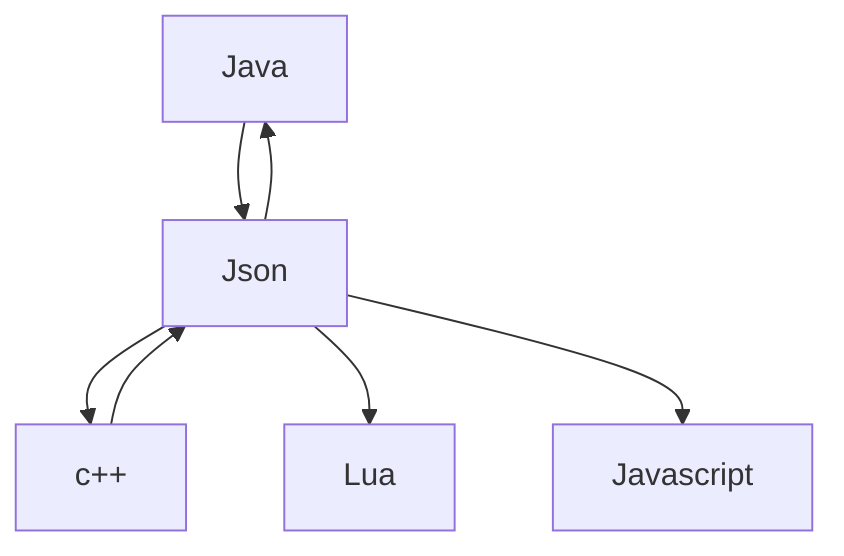

# Lógica e Serialização de Dados

Este repositório contém exercícios e exemplos práticos que exploram conceitos de lógica de programação aplicados à serialização e desserialização de dados. O
## Serialização de dados utilizando JSON, XML E YAML


### 1 - O que é serialização de dados?
A serialização de dados é um processo fundamental na programação, que envolve a conversão de estruturas 
de dados complexas em um formato que possa ser facilmente armazenado, transmitido ou compartilhado entre
diferentes sistemas. No contexto deste guia, abordaremos a serialização de dados em linguagem simples e direta,
adequada para desenvolvedores de todos os níveis de experiência.



 foco está em formatos comuns como JSON, XML e outros, utilizando diferentes linguagens e bibliotecas.
 
---

## Visão Geral dos Exercícios

| Exercício      | Descrição                                           | Status       |
|----------------|-----------------------------------------------------|--------------|
| Exercício 1    | Serialização e desserialização de dados em JSON.    | Concluído    |
| Exercício 2    | Manipulação de arquivos JSON para persistência.     | Concluído    |
| Exercício 3    | Introdução à serialização XML (planejado).          | Planejado    |
| Exercício 4    | Serialização customizada e otimizações (planejado). | Planejado    |

---

## Como usar

1. Clone o repositório:

```bash
git clone https://github.com/HamiltonVentura/Logica-Serializacao-Dados.git

