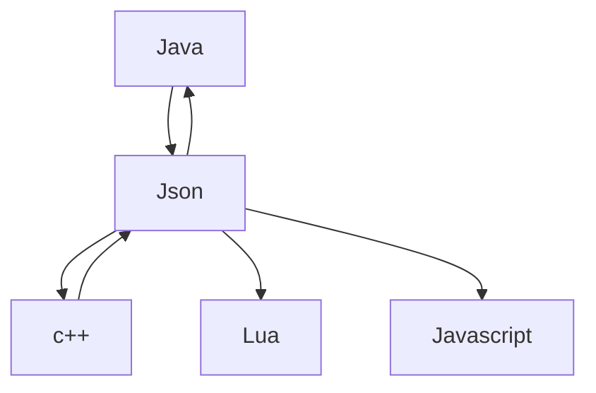

# Serializacao-dados
## Serialização de dados utilizando JSON, XML E YAML

### 1 - O que é serialização de dados?
A serialização de dados é um processo fundamental na programação, que envolve a conversão de estruturas 
de dados complexas em um formato que possa ser facilmente armazenado, transmitido ou compartilhado entre
diferentes sistemas. No contexto deste guia, abordaremos a serialização de dados em linguagem simples e direta,
adequada para desenvolvedores de todos os níveis de experiência.

